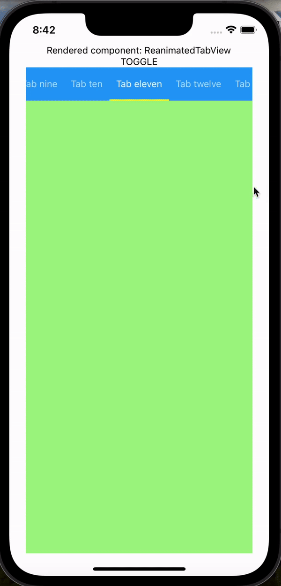
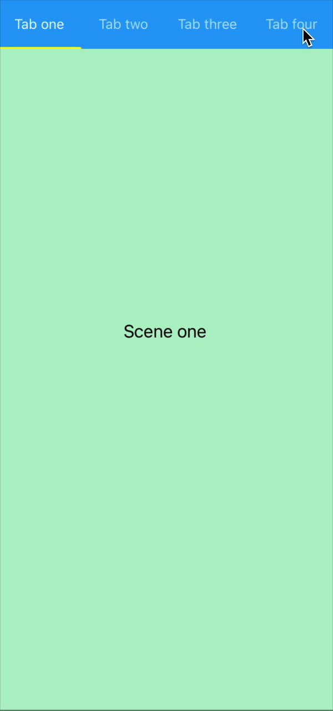
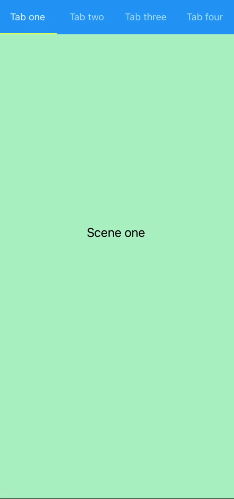

# Reanimated Tab View

A custom Tab View component implemented using [`react-native-reanimated`](https://github.com/software-mansion/react-native-reanimated/) and [`react-native-gesture-handler`](https://github.com/software-mansion/react-native-gesture-handler/). Props are almost entirely inter-compatible with [`react-native-tab-view`](https://github.com/satya164/react-native-tab-view)

- The [example/](https://github.com/adithyavis/reanimated-tab-view/tree/main/example) folder contains reference code to use the library.

## Demo

<a href="https://github.com/adithyavis/reanimated-tab-view/raw/main/assets/assets_demo.mp4"></a>

## Features

reanimated-tab-view provides the following features that are provided by react-native-tab-view

- Smooth animations and gestures
- Scrollable tabs
- Supports both top and bottom tab bars
- Follows Material Design spec
- Highly customizable
- Fully typed with [TypeScript](https://typescriptlang.org)

Additionally, reanimated-tab-view also provides the following features

- 3 render modes to render the tab view ("all", "windowed" and "lazy"). Can be modified using the `renderMode` prop.
  - All render mode renders all the scenes in one go, during the initial tab view mount. When the number of scenes is large, it is recommended to use the window mode/lazy mode.
  - Windowed render mode renders a window of scenes, including the current scene and the scenes adjascent to it. This is the default render mode. It is recommended to use this render mode when the number of scenes is large but when the render cost of each scene is not high.
  - Lazy render mode renders the scenes one by one when they are first mounted to the view. It is recommended to use this render mode when the number of scenes is large and when the render cost of each scene is high.
- Dynamic widths for tabs, based on the tab title length. For eg., if the tab title is "Tab one", the width of the tab will be smaller than if the tab title is "Tab hundred one".
  - This feature is in accordance with the Material Design spec.
  - This is disabled by default. To enable this, set the `tabBarScrollEnabled` prop to `true`, or set the `tabBarType` prop to `'primary'`.
    
- Customisable jump-to animations (smooth jump or scroll jump). Can be modified using the `smoothJump` prop.
  - Scroll jump: When jumped from tab one to tab four, the jump animation scrolls through the scenes in between (scenes of tab two and tab three). In case the scenes in between are not rendered (while using lazy/windowed render modes), the jump-to animation will result in a momentary blank splash.
  - Smooth jump: When jumped from tab one to tab four, the jump animation smoothly animates to the target scene of tab four without scrolling through the scenes in between. This helps prevent blank splashes when using lazy/windowed render modes. This is enabled by default.
    | Smooth Jump | Scroll Jump |
    |:----------:|:------------------:|
    |  |  |

> #### Upcoming features
>
> - Accessibility
> - RTL support
> - TabView collapsible Headers

## Motivation

1.  The original react-native-tab-view is an amazing package, no doubt. However,
    it is dependent on [`react-native-pager-view`](https://github.com/callstack/react-native-pager-view).
    This dependency complicates solving issues such as

- [`TabView tab index not really controlled`](https://github.com/react-navigation/react-navigation/issues/11412)
- [`Tab label aligning vertically in some devices when render single tab.`](https://github.com/react-navigation/react-navigation/issues/11083)
- [`Screen getting stuck when switching between the tabs while keyboard opened.`](https://github.com/react-navigation/react-navigation/issues/11301).

reanimated-tab-view depends purely on react-native-reanimated, and as such, the above issues won't be encountered.

2.  The swipe and jump-to behaviors in reanimated-tab-view are more controllable. Our implementation of the swipe and jump-to behaviors are built from scratch using the animation and gesture primitives offered by react-native-reanimated and react-native-gesture-handler.

## Installation

Install react-native-reanimated (>=2.x) and react-native-gesture-handler (>=2.x).

- https://docs.swmansion.com/react-native-reanimated/docs/2.x/fundamentals/installation
- https://docs.swmansion.com/react-native-gesture-handler/docs/fundamentals/installation

Open a Terminal in the project root and run:

```sh
yarn add reanimated-tab-view
```

## Quick Start

```js
import * as React from 'react';
import { View, useWindowDimensions } from 'react-native';
import { TabView } from 'reanimated-tab-view';

const FirstRoute = () => (
  <View style={{ flex: 1, backgroundColor: '#ff4081' }} />
);

const SecondRoute = () => (
  <View style={{ flex: 1, backgroundColor: '#673ab7' }} />
);

const renderScene = ({ route }) => {
  switch (route.key) {
    case 'first':
      return <FirstRoute />;
    case 'second':
      return <SecondRoute />;
    default:
      return null;
  }
};

export default function TabViewExample() {
  const layout = useWindowDimensions();

  const [index, setIndex] = React.useState(0);
  const [routes] = React.useState([
    { key: 'first', title: 'First' },
    { key: 'second', title: 'Second' },
  ]);

  return (
    <TabView
      navigationState={{ index, routes }}
      renderScene={renderScene}
      onIndexChange={setIndex}
      initialLayout={{ width: layout.width }}
    />
  );
}
```

| Name                | Description                                                               | Required | Type                        | Default     |
| ------------------- | ------------------------------------------------------------------------- | -------- | --------------------------- | ----------- |
| navigationState     | The state of the navigation including the index and routes.               | Yes      | Object                      |             |
| renderScene         | A function that renders the scene for a given route.                      | Yes      | Function                    |             |
| onIndexChange       | A function that is called when the index changes.                         | Yes      | Function                    |             |
| initialLayout       | The initial layout of the tab view.                                       | No       | Object                      | undefined   |
| sceneContainerStyle | The style for the scene container.                                        | No       | Object                      | undefined   |
| keyboardDismissMode | Specifies how to dismiss the keyboard.                                    | No       | String                      | 'none'      |
| swipeEnabled        | Enables or disables swipe gestures.                                       | No       | Boolean                     | true        |
| renderMode          | Specifies the layout mode of the tab view.                                | No       | `'windowed'\|'lazy'\|'all'` | "windowed"  |
| tabBarPosition      | Specifies the position of the tab bar.                                    | No       | `'top'\|'bottom'`           | 'top'       |
| tabBarType          | Specifies the type of the tab bar, according to the Material Design spec. | No       | `'primary'\|'secondary'`    | 'secondary' |
| smoothJump          | Enables or disables smooth jumping between tabs.                          | No       | Boolean                     | true        |
| tabBarScrollEnabled | Enables or disables scrollable tab bar.                                   | No       | Boolean                     | true        |
| renderTabBar        | Custom method to render the tab bar.                                      | No       | Function                    | undefined   |
| onSwipeEnd          | Callback function for when a swipe gesture ends.                          | No       | Function                    | undefined   |
| onSwipeStart        | Callback function for when a swipe gesture starts.                        | No       | Function                    | undefined   |

## Author

- [Adithya Viswamithiran](https://github.com/adithyavis/)

## License

[MIT](./LICENSE)
